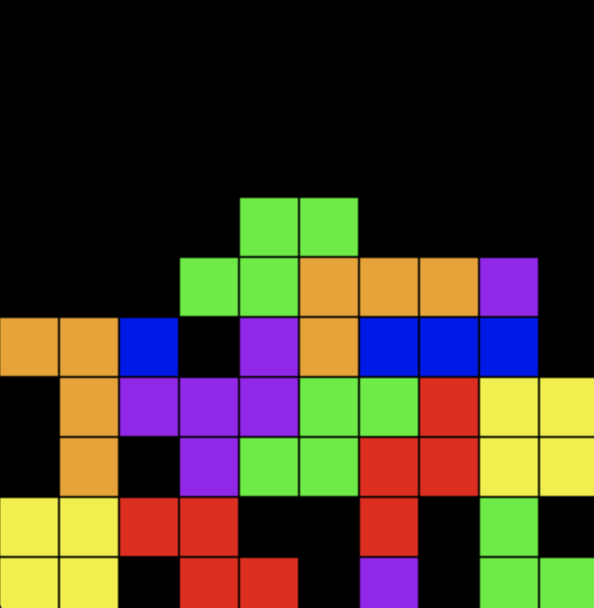

# TetrisRL
This is a Tetris game played by an AI through reinforcement learning. We use Pytorch for creating the model and OpenCV for displaying the actual game.

## Contributors:
David Han, Emmett Breen, Evan Williams

## Requirements
* Numpy
* torch
* termcolor
* openCV
* Pillow

## Usage
* pip3 install -r `requirements.txt`
* To run the model, run `python3 run.py` (a window opens up with the Tetris game using the final trained model)
* For running, run `python3 train.py`

## Other Specifications
There are a few parameters that can be modified while the model is being trained. 
* `epochs` (default = 30000)
* `epsilon` (default = 1) Used for Epsilon-Greedy Algorithm. Epsilon should never be above 1 and below the epsilon floor (0.001)
* `gamma` (default = 0.999) Used for Epsilon-Greedy Algorithm which is the rate of decay for epsilon. A gamma closer to 1 will decay at a slower rate, while smaller gamma will decrease epsilon more quickly
* `replay_size` (default = 100000) Used for keeping track of current states of Tetris
* `minibatch_size` (default = 200) Parameter for size of minibatch for replay states

## Visualization
This is a sample frame of the Tetris game played by the AI:

